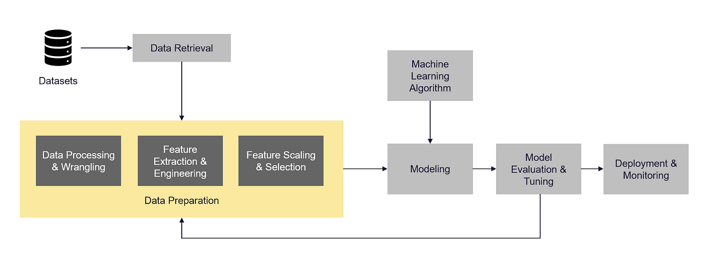
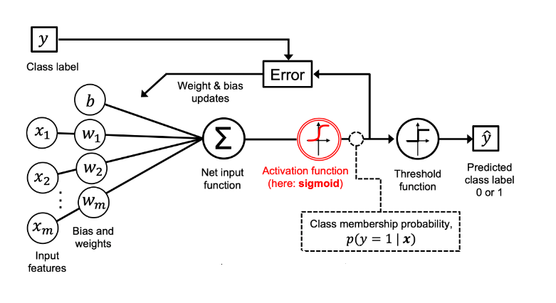
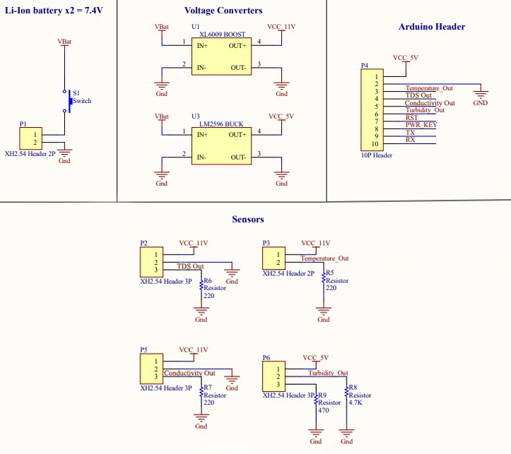
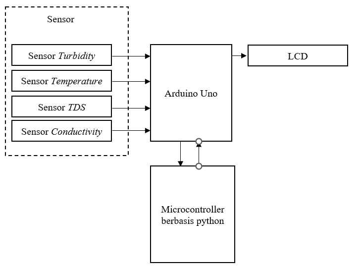

# REGRESI LOGISTIK UNTUK KLASIFIKASI PENCEMARAN KUALITAS AIR PADA SISTEM SENSOR ROBOT
Peneliti memakai metode logistic regression dalam upaya untuk membangun sistem klasifikasi kualitas air pada sistem robot bawah air dengan alur data berupa berikut

 Kode ini menggabungkan fitur polinomial menggunakan "PolynomialFeatures transformer", yang memungkinkan model regresi logistik untuk menangkap hubungan non-linier antara fitur masukan. Selain itu, kode menggunakan VotingClassifier untuk membuat model ansambel yang menggabungkan prediksi model regresi logistik berganda yang dilatih pada subkumpulan data yang berbeda. 

## Sensor
alat alat yang di pakai berupa berikut dan komputer

## Block diagram

